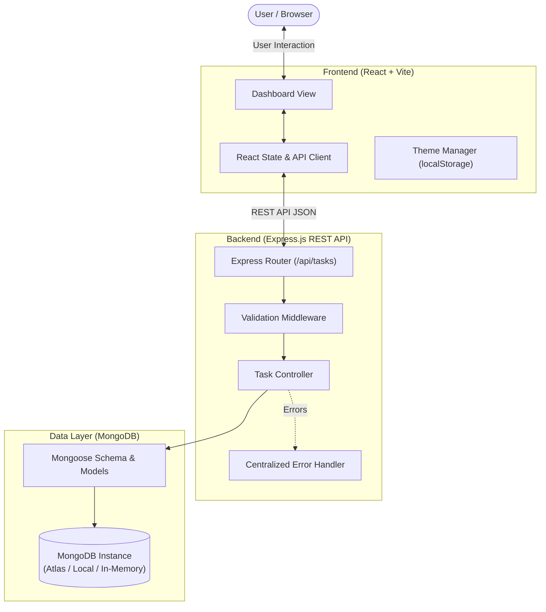

# TaskFlow — Smart Task Manager 🚀

> A full-stack, production-grade productivity dashboard designed to create, organize, prioritize, track, search, filter, edit, and complete tasks with dynamic analytics and seamless dark mode.


---

## 📋 Table of Contents
- [Project Overview](#-project-overview)
- [Key Features](#-key-features)
- [Technology Stack](#-technology-stack)
- [System Architecture](#-system-architecture)
- [Database Schema](#-database-schema)
- [REST API Documentation](#-rest-api-documentation)
- [Project Structure](#-project-structure)
- [Installation & Setup](#-installation--setup)
- [Evaluation & Presentation Highlights](#-evaluation--presentation-highlights)
- [Future Improvements](#-future-improvements)

---

## 🎯 Project Overview

**TaskFlow** was built to provide an intuitive, high-performance task management experience that eliminates productivity friction. It features a modern SaaS dashboard interface with dynamic metric calculation, live multi-criteria filtering, instant search, relative due date tracking, intelligent overdue status alerts, and a persistent dark mode theme.

---

## ✨ Key Features

### 1. 📊 Interactive Dashboard & Live Statistics
- **Dynamic Metrics**: Instant database-calculated statistics for:
  - **Total Tasks**: Total count of all tasks.
  - **Completed Tasks**: Tasks marked as finished.
  - **Pending Tasks**: Incomplete tasks awaiting execution.
  - **High Priority Tasks**: Critical items highlighted with a flame indicator.
  - **Completion Rate**: Dynamic percentage formula: `(Completed / Total) × 100` with visual gradient progress bar.
- **Auto-Syncing**: Statistics update dynamically across all CRUD, status toggle, and filter operations without requiring manual page refresh.

### 2. ⚡ Complete Task CRUD
- **Create**: Add new tasks with title, description, priority, target due date, and status.
- **Read**: View tasks as clean cards with priority tags, status chips, and relative due date indicators.
- **Update**: Modal editor allowing full modification of task fields with live character counters.
- **Delete**: Protected by a confirmation modal preventing accidental deletions.
- **Status Toggle**: One-click checkbox to toggle tasks between `Pending` and `Completed`. Completed tasks automatically record a `completedAt` timestamp, receive strikethrough typography, and feature subtle opacity reduction.

### 3. 🏷️ Priority Management
- Visual color-coded priority badges on every task card:
  - 🔴 **High Priority**: Red indicator
  - 🟡 **Medium Priority**: Amber/Yellow indicator
  - 🟢 **Low Priority**: Emerald/Green indicator

### 4. 📅 Smart Due Date Tracking & Overdue Detection
- Contextual relative time tags:
  - **Due Today** (amber highlight)
  - **Due Tomorrow**
  - **Due in X days**
  - **Overdue (X days ago)**: Highlighted with a red alert border and badge.
- **Business Logic**: Only **pending** tasks can be marked overdue. Once a task is completed, overdue flags are automatically dismissed.

### 5. 🔍 Real-Time Search & Multi-Condition Filtering
- **Instant Search**: Case-insensitive search across both **Task Title** and **Description**.
- **Status Filter**: `All`, `Pending`, `Completed`.
- **Priority Filter**: `All`, `High`, `Medium`, `Low`.
- **Timeline Filter**: `All`, `Due Today`, `Upcoming`, `Overdue`.
- **Combined Filtering**: Filters work concurrently (e.g., *High Priority* + *Pending* + *Due Today* displays only tasks satisfying all three criteria).

### 6. ↕️ Immediate Sorting
- **Newest first** (Creation date descending)
- **Oldest first** (Creation date ascending)
- **Due Date** (Earliest due date first, tasks without dates at the bottom)
- **Priority** (High → Medium → Low)
- **Alphabetical** (A to Z by title)

### 7. 📄 Task Details Modal
- Click on any task card to open a detailed modal view featuring:
  - Title, description, and status/priority badges
  - Target Due Date
  - Created Date & Last Updated Date
  - Completion Date (if completed)
  - Quick action buttons (Toggle Status, Edit, Delete)

### 8. 🌙 Dark & Light Mode
- Seamless theme switching between Light and Dark mode.
- System preference auto-detection.
- Preference saved in `localStorage` for cross-session persistence.

### 9. 📱 100% Responsive Design
- Modern SaaS aesthetic using Tailwind CSS.
- Mobile slide-out drawer navigation menu.
- Responsive CSS Grid: adapts from 1 column on mobile to 2 columns on tablets and 3 columns on wide screens.
- Zero horizontal overflow.

### 10. 🛡️ Client & Server Validation
- **Title**: Required, 3–100 characters, auto-trimmed.
- **Description**: Optional, maximum 500 characters.
- **Priority**: Restricted to `'low'`, `'medium'`, `'high'`.
- **Status**: Restricted to `'pending'`, `'completed'`.
- **Due Date**: Validated ISO date format.

---

## 🛠 Technology Stack

### Frontend
- **Framework**: [React 18](https://react.dev/)
- **Build Tool**: [Vite 5](https://vitejs.dev/)
- **Styling**: [Tailwind CSS 3](https://tailwindcss.com/)
- **Icons**: [Lucide React](https://lucide.dev/)
- **Date Formatting**: [date-fns](https://date-fns.org/)
- **HTTP Client**: [Axios](https://axios-http.com/)

### Backend
- **Runtime**: [Node.js](https://nodejs.org/) (LTS v24)
- **Framework**: [Express.js](https://expressjs.com/)
- **CORS & Logger**: `cors`, `morgan`
- **Environment**: `dotenv`

### Database
- **ODM**: [Mongoose 8](https://mongoosejs.com/)
- **Database**: [MongoDB](https://www.mongodb.com/) (Supports MongoDB Atlas, Local MongoDB, and seamless automated in-memory fallback via `mongodb-memory-server` for instant offline testing and live presentations).

---

## 🏛 System Architecture



---

## 🗄 Database Schema

The Task entity is defined using Mongoose (`server/models/Task.js`):

```javascript
{
  title: {
    type: String,
    required: [true, 'Task title is required'],
    trim: true,
    minlength: 3,
    maxlength: 100
  },
  description: {
    type: String,
    trim: true,
    maxlength: 500,
    default: ''
  },
  priority: {
    type: String,
    enum: ['low', 'medium', 'high'],
    default: 'medium'
  },
  status: {
    type: String,
    enum: ['pending', 'completed'],
    default: 'pending'
  },
  dueDate: {
    type: Date,
    default: null
  },
  completedAt: {
    type: Date,
    default: null
  },
  createdAt: { type: Date }, // Managed by timestamps: true
  updatedAt: { type: Date }  // Managed by timestamps: true
}
```

### Database Indexes
- `{ status: 1, priority: 1 }` — High-efficiency compound filtering
- `{ dueDate: 1 }` — Fast timeline range queries (Today, Upcoming, Overdue)
- `{ createdAt: -1 }` — Default newest-first chronological sorting

---

## 📡 REST API Documentation

Base URL: `http://localhost:5000/api`

| Method | Endpoint | Description | Query / Body Parameters |
|---|---|---|---|
| `GET` | `/api/health` | Service health status | None |
| `GET` | `/api/tasks` | Get tasks with filtering | `search`, `status`, `priority`, `timeFilter`, `sort` |
| `GET` | `/api/tasks/stats` | Aggregated dashboard metrics | None |
| `GET` | `/api/tasks/:id` | Get single task details | `id` (MongoDB ObjectId) |
| `POST` | `/api/tasks` | Create a new task | `{ title, description?, priority?, dueDate?, status? }` |
| `PUT` | `/api/tasks/:id` | Update an existing task | Full / Partial task payload |
| `PATCH` | `/api/tasks/:id/status` | Toggle or update task status | `{ status?: 'pending' \| 'completed' }` |
| `DELETE` | `/api/tasks/:id` | Permanently remove a task | `id` (MongoDB ObjectId) |

### Sample Requests & Responses

#### 1. Create Task (`POST /api/tasks`)
**Request Body:**
```json
{
  "title": "Prepare final internship demo",
  "description": "Showcase CRUD, filters, statistics, and dark mode to examiners",
  "priority": "high",
  "dueDate": "2026-09-25T18:00:00.000Z",
  "status": "pending"
}
```
**Response (`201 Created`):**
```json
{
  "success": true,
  "message": "Task created successfully",
  "data": {
    "_id": "6724a8bf7e4359218d6a89c1",
    "title": "Prepare final internship demo",
    "description": "Showcase CRUD, filters, statistics, and dark mode to examiners",
    "priority": "high",
    "status": "pending",
    "dueDate": "2026-09-25T18:00:00.000Z",
    "completedAt": null,
    "createdAt": "2026-09-23T13:46:14.283Z",
    "updatedAt": "2026-09-23T13:46:14.283Z"
  }
}
```

#### 2. Get Statistics (`GET /api/tasks/stats`)
**Response (`200 OK`):**
```json
{
  "success": true,
  "data": {
    "totalTasks": 10,
    "completedTasks": 3,
    "pendingTasks": 7,
    "highPriorityTasks": 4,
    "overdueTasks": 1,
    "completionRate": 30
  }
}
```

---

## 📂 Project Structure

```text
taskflow/
├── client/                      # Frontend Application (React + Vite)
│   ├── src/
│   │   ├── components/          # Modular Reusable React UI Components
│   │   │   ├── DeleteConfirmModal.jsx
│   │   │   ├── EmptyState.jsx
│   │   │   ├── FilterBar.jsx
│   │   │   ├── Header.jsx
│   │   │   ├── SettingsModal.jsx
│   │   │   ├── Sidebar.jsx
│   │   │   ├── StatsCards.jsx
│   │   │   ├── TaskCard.jsx
│   │   │   ├── TaskDetailsModal.jsx
│   │   │   ├── TaskFormModal.jsx
│   │   │   └── Toast.jsx
│   │   ├── services/
│   │   │   └── api.js           # Centralized Axios API service
│   │   ├── App.jsx              # Main dashboard view & state orchestration
│   │   ├── index.css            # Tailwind directives & design tokens
│   │   └── main.jsx             # React DOM root entry point
│   ├── index.html
│   ├── package.json
│   ├── postcss.config.js
│   ├── tailwind.config.js
│   └── vite.config.js
│
├── server/                      # Backend REST API (Node.js + Express)
│   ├── config/
│   │   └── db.js                # Dual-mode Mongoose & In-Memory connector
│   ├── controllers/
│   │   └── taskController.js    # Business logic, query engine, stats calculator
│   ├── middleware/
│   │   ├── errorHandler.js      # Centralized error & 404 response handler
│   │   └── validator.js         # Input sanitization and format validation
│   ├── models/
│   │   └── Task.js              # Mongoose Task schema definition
│   ├── routes/
│   │   └── taskRoutes.js        # Express REST endpoints
│   ├── .env                     # Server environment variables
│   ├── .env.example
│   ├── package.json
│   └── server.js                # Express app entry & unified static host
│
├── .env.example                 # Root environment template
├── .gitignore                   # Git ignore rules
├── package.json                 # Workspace orchestrator
└── README.md                    # Project documentation
```

---

## 🚀 Installation & Setup

### Prerequisites
- **Node.js** (v18 or higher recommended; v24 LTS tested)
- **npm** (v9 or higher)
- **MongoDB** (Optional: TaskFlow connects to your MongoDB URI if provided, or automatically starts an embedded in-memory database if no external daemon is running).

### Step-by-Step Instructions

#### 1. Navigate to Project Directory
```bash
cd taskflow
```

#### 2. Configure Environment Variables
Copy `.env.example` to `server/.env` (or customize as needed):
```bash
cp .env.example server/.env
```
Default configuration:
```env
PORT=5000
NODE_ENV=development
MONGODB_URI=mongodb://localhost:27017/taskflow
CLIENT_URL=http://localhost:5173
```

#### 3. Install Dependencies
Install dependencies for both backend and frontend:
```bash
# Install backend dependencies
cd server
npm install

# Install frontend dependencies
cd ../client
npm install
cd ..
```

#### 4. Start the Application

You can run TaskFlow in two ways:

##### Option A: Unified Server (Production Mode)
The Express server serves both the REST API and the compiled React frontend from a single port:
```bash
# Inside taskflow/server:
npm start
```
Open your browser and navigate to: **`http://localhost:5000`**

##### Option B: Concurrent Development Mode (Vite HMR)
Run both backend and frontend development servers concurrently:
```bash
# Terminal 1 (Backend):
cd server
npm run dev

# Terminal 2 (Frontend with Vite Hot Module Replacement):
cd client
npm run dev
```
Open your browser and navigate to: **`http://localhost:5173`**

---

## 🎓 Evaluation & Presentation Highlights

When demonstrating TaskFlow in your college or internship presentation, showcase these features:
1. **Full CRUD in Action**: Create a task with validation (e.g. attempt submitting a 2-character title to demonstrate instant error feedback).
2. **Dynamic Dashboard Statistics**: Check off a task and observe the **Completed Tasks** counter and **Completion Rate** progress bar update instantly without page reload.
3. **Multi-Filter Coordination**: Apply **High Priority** + **Pending** + **Due Today** simultaneously to show the compound query engine.
4. **Intelligent Overdue Highlight**: Notice how overdue pending tasks display a bold red warning border and badge, while completed tasks never trigger overdue alerts.
5. **Dark Mode Persistence**: Toggle theme, refresh the browser, and demonstrate that the preference is preserved via `localStorage`.
6. **Responsive Layout**: Resize the browser window to mobile dimensions to show the collapsible sidebar drawer and stacked card grid.
7. **Robust Architecture**: Explain the separation of concerns: reusable React components, custom Axios service, Express routing, Mongoose schema validation, and database indexing.

---

## 🔮 Future Improvements

- [ ] **User Authentication**: Secure multi-tenant user accounts with JWT & OAuth 2.0.
- [ ] **Team Collaboration**: Workspaces, task assignment, and activity comments.
- [ ] **Calendar & Kanban Views**: Visual drag-and-drop Kanban board and monthly calendar view.
- [ ] **Recurring Tasks**: Daily, weekly, or custom recurring intervals.
- [ ] **Push & Email Notifications**: Automated reminder alerts 24 hours before a due date.
- [ ] **Export & Import**: Export task lists to CSV or JSON formats.

---

## 📄 License
This project is licensed under the MIT License — free for educational and commercial use.
